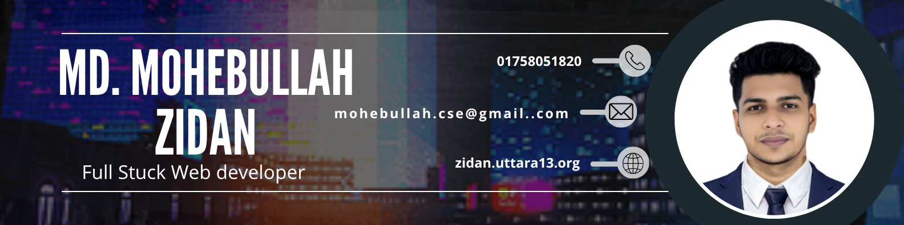

<!--Banar Section Start-->

<!--Banar Section End-->

<!--Title & Typography Section End-->
<h1 align="center">Hi ,I'm Md. Mohebullah</h1>

    
<!--Title & Typography Section End-->

<!-- Profile View Section Start -->

  

<!-- Profile View Section End -->

<!-- Header subtitle area start -->

  

    
      💻 Passionate about coding, creating, and continuous learning.
    
    👋 I'm <strong>Md. Mohebullah</strong>, a <strong>Full Stack ASP.NET Developer</strong> and <strong>Machine Learning Enthusiast</strong>. I build practical web applications using ASP.NET and SQL Server, and I enjoy exploring machine learning with Python. I have completed an <strong>internship at E-Group Ltd</strong>, where I learned and developed ASP.NET web applications with Microsoft SQL Server. My skills include <strong>Python</strong>, <strong>ASP.NET MVC</strong>, <strong>Microsoft SQL Server</strong>, and data/ML libraries such as <strong>NumPy</strong>, <strong>Pandas</strong>, and <strong>Matplotlib</strong>. I also have a basic understanding of DevOps. I am always eager to learn new technologies and improve my craft.
  

<!-- Header subtitle area end -->

<!-- Header subtitle area end -->

<!--Body Right Section start-->

<!--Body Right Section End-->

<!--Body Left Section Start-->

- 👨‍💻 I am currently working as a Full Stack Software Developer at **[E-Group Ltd](https://e-groupltd.com/)**.

- 🎓 I graduated from **[IUBAT University](https://iubat.edu/)** with a degree in Computer Science and Engineering.

- 🏛️ I was a student in the **[BCSE Department](https://cse.iubat.edu/)**.

- 📫 You can reach me at **<mohebullah.cse@gmail.com>**

- ⚡ Fun fact **I love teaching and simplifying complex topics**
<!--Body Left Section End-->

<!--Connect with me Section Start-->
<h3 align="left"> 🌐 Connect with me :</h3>

[

<!--Connect with me Section End-->

## 💼 Experience

| Position                         | Institute |   Duration       | Location            | 
| -------------------------------- | --------- | ---------------- | --------------------| 
| Full Stack ASP.NET Developer     |  E-Group  |    Present       | Utatra13, Dhaka     | 
| ASP.NET Developer (Internship)   |  E-Group  |6th june to 30 sep| Utatra13, Dhaka     | 

#### 🚀 Featured Projects & Full Stack Development

- 🌐 [E-Group Ltd Website](https://e-groupltd.com)  
  I designed and developed the official website for E-Group Ltd, a leading IT solutions provider in Bangladesh. This project demonstrates my expertise in full stack development using **ASP.NET Core** and **Microsoft SQL Server**. The site features a modern, responsive UI, dynamic service listings, a portfolio section, and a secure contact form. I managed the entire deployment process, ensuring the site is fast, reliable, and secure on a live server.

- 🌐 [Uttara13 Community Website](https://uttara13.org)  
  I built and launched the Uttara13 community website, which serves as a digital hub for the Uttara 13 residential area. The platform provides local news, community announcements, event updates, and a member directory. Developed with **ASP.NET Core** and **SQL Server**, I handled both backend and frontend, as well as deployment and ongoing maintenance. The site is optimized for accessibility and user engagement.

> My full stack development skills include designing robust databases, building scalable APIs, creating interactive frontends, and deploying web applications to production environments. I also have experience integrating optional machine learning features using Python when needed.

#### 🎯 Private Tutor – Highlights

- 📘 Taught SSC core subjects; improved foundations and problem-solving
- ✍️ Designed personalized lesson plans and engaging study materials
- 🧑‍🏫 Developed and edited educational content for clarity and accuracy
  I built and launched the Uttara13 community website, which serves as a digital hub for the Uttara 13 residential area. The platform provides local news, community announcements, event updates, and a member directory. Developed with ASP.NET Core, the site is optimized for accessibility and ease of use, helping residents stay connected and informed.

#### 🎯 Private Tutor – Highlights

- 🧠 Develop high level web application useing the asp.net core
- 📘 Taught SSC core subjects; improved foundations and problem-solving
- ✍️ Designed personalized lesson plans and engaging study materials
- 🧑‍🏫 Developed and edited educational content for clarity and accuracy

<!-- Developer Hub section start -->

## 🧰 Tech Stack

**🌟 Full Stack Development (ASP.NET Platform):**

  &emsp;
  &emsp;
  &emsp;
  &emsp;
  &emsp;
  &emsp;
  &emsp;
  &emsp;
  

**Other Programming & Data Science:**

  &emsp;
  &emsp;
  &emsp;
  &emsp;
  &emsp;
  

**Other Databases & Cloud:**

  

**Tools & IDEs:**

  &emsp;
  &emsp;
  &emsp;
  &emsp;
  

<!-- Developer Hub section end -->

## 🎓 Education

#### 💻 B.Sc. in Computer Science & Engineering (CSE)

**IUBAT – International University of Business Agriculture and Technology**, Uttara Model Town, Dhaka, Bangladesh  
📅 Sep 2021 – 2025      | 🎯 CGPA: 3.63 / 4.00  
⏳ Duration: 4 Years    | 📚 Status: **Graduated**

- Relevant coursework: OOP, Databases, Discrete Maths, Data Structures and Algorithms, Operating Systems, Computer Networks, Machine Learning, Advanced Data Structures and Algorithms, Image Processing, Deep Learning

<!--Certification Section Start-->

## 👨🏻‍🎓 Certifications & Training

| Licenses & Certifications              | Issuing Organization | Year | Credential ID / Link |
| -------------------------------------- | -------------------- | ---- | -------------------- |
| Intro to Machine Learning              | Kaggle               | 2024 |   [Certificate](https://www.kaggle.com/learn/certification/mdmohebullah/intro-to-machine-learning)   
| Intermediate Machine Learning          | Kaggle               | 2024 |   [Certificate](https://www.kaggle.com/learn/certification/mdmohebullah/intermediate-machine-learning)           
| Intro to Deep Learning                 | Kaggle               | 2025 |   [Certificate](https://www.kaggle.com/learn/intro-to-deep-learning)                              
| Basic Graphic Design                   | Pentanik IT BD       | 2021 |   [Certificate](https://drive.google.com/file/d/1JP2pzU7PZLxd7WYA-m33qhqWbVUm4_lg/view)
| Data Science Math Skills               | Coursera             | 2025 |   [Certificate](https://www.coursera.org/account/accomplishments/verify/8WHPVSVIP498?utm_source=link&utm_medium=certificate&utm_content=cert_image&utm_campaign=sharing_cta&utm_product=course)

<!--Certification Section end-->

## 🧪 Projects

| Project                                   | Tech Stack                                                        | Year | Repository / Live |
| ----------------------------------------- | ----------------------------------------------------------------- | ---- | ----------------- |
| Sector 13 Welfare Society – Management    | ASP.NET MVC, Blazor Server, SQL Server                            | 2025 | [Repository](https://github.com/CodeByMoheb/Sector-13-wllfare-socity-project) |
| Alzheimer’s Disease Classification        | Python, TensorFlow, Swin Transformer, NumPy, Matplotlib, Pandas   | 2025 | —                 |
| Meal Management System                    | .NET MVC, XAMPP (MySQL), HTML/CSS, JavaScript                     | 2024 | —                 |
| Hostel Management System                  | ASP.NET MVC, Microsoft SQL Server, HTML/CSS, JavaScript           | 2025 | —                 |

## 💡 Quote of the Day

  <em>“Every error is an opportunity to learn. Don't be afraid to make mistakes; they're part of the coding process.”</em>  
    
  <strong>  Md. Mohebullah</strong>

## 📊 GitHub Stats

&nbsp;

  

<!-- footer section start -->

Thanks for going through my personal Portfolio | All rights reserved by ❤️ <a href="https://www.linkedin.com/in/codebymoheb/">Md. Mohebullah</a> © 2019 - 2025

<!-- footer section end -->

